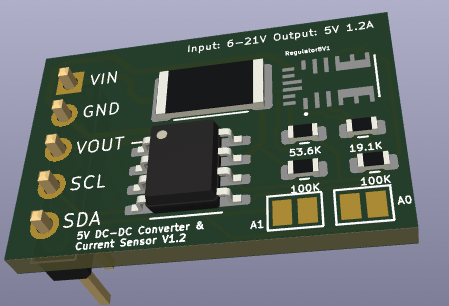

PowerBOARD v1.2
===============

A simple breakout board with a switching DC/DC power supply (MPM3610A) and a I2C current sensor (INA219). Accepts ~6-21V and outputs 5V 1.2A.

Changelog
-----

v2
* Dropped Schotty diode on Vin.
* Added jumpers for A0 & A1

Todo
----
* Make the MPM3610 show up in the 3d model
